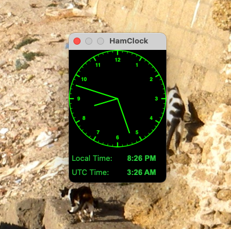

# HamClock

A small analog clock face that sits on your desktop.

## Getting Started

Open the project in Xcode and build it.

### Prerequisites

Xcode. It's Objective C, so it shouldn't be too hard.

### Installing

Open the project in Xcode and build it.

## Running the tests

Sorry, no tests.

## Deployment

Copy the output executable to your Applications folder.

## Built With

* Xcode.

## Contributing

Yeah, just tell me what you want.

## Versioning

No versions yet.

## Authors

* **Rich Nistuk** - *Initial work* - [rnistuk](https://github.com/PurpleBooth)

See also the list of [contributors](https://github.com/rnistuk) 

## License

This project is licensed under the don't be a dick license.

## Acknowledgments

* The Burnaby Amateur Radio Club www.ve7bar.org
